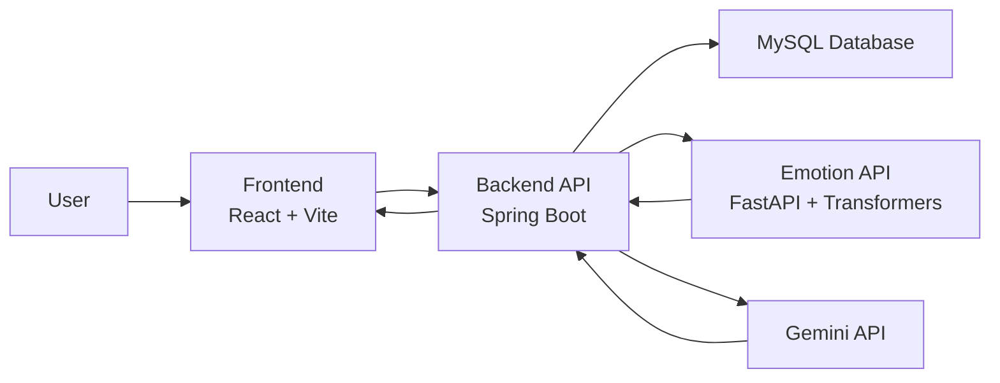

# Stress Detection for Students

## Project Overview

This project is a student support system that guides users through short topic-based assessment flows and then continues with a supportive chat experience. The system is designed around common student concerns such as:

- Anxiety
- Academic stress
- Relationship concerns

The application combines structured guidance, emotion detection, and AI-assisted follow-up responses to provide supportive next steps in a more personalized way.

## Main Features

- Topic-based guided sessions for different student wellbeing concerns
- Step-by-step question flow with multiple question types:
  - Multiple choice
  - Yes/No
  - Scale/range
  - Free text
- Automatic session summary generation after a user completes a topic flow
- Recommendation generation based on the user’s answers and impact level
- Post-assessment chat assistant for continued support
- Emotion-aware chat responses using a separate emotion classification API
- Persistent storage of topics, sessions, answers, outcomes, and chat messages in MySQL

## Topics Included

The current system is seeded with the following support topics:

- `ANXIETY`
- `ACADEMIC_STRESS`
- `RELATIONSHIPS`

These topics and their initial guided questions are seeded automatically on first backend startup through [`/Users/sandarunipuna/Documents/Projects/topic-guidance-project/backend/src/main/java/com/sliit/tg/config/DataSeeder.java`](/Users/sandarunipuna/Documents/Projects/topic-guidance-project/backend/src/main/java/com/sliit/tg/config/DataSeeder.java).

## System Architecture

The project is split into three main parts:



### 1. Frontend

Location: [`/Users/sandarunipuna/Documents/Projects/topic-guidance-project/frontend`](/Users/sandarunipuna/Documents/Projects/topic-guidance-project/frontend)

Built with:

- React
- Vite

Responsibilities:

- Display the guided question flow
- Show progress and final recommendations
- Start and continue chat sessions
- Provide a clean student-facing UI

### 2. Backend

Location: [`/Users/sandarunipuna/Documents/Projects/topic-guidance-project/backend`](/Users/sandarunipuna/Documents/Projects/topic-guidance-project/backend)

Built with:

- Java 17
- Spring Boot
- Spring Web
- Spring Data JPA
- MySQL

Responsibilities:

- Expose REST APIs for topics, sessions, answers, and chat
- Manage persistence for sessions and chat history
- Score guided answers and generate recommendations
- Connect to the emotion detection API
- Connect to Gemini for follow-up conversational support

### 3. Emotion API

Location: [`/Users/sandarunipuna/Documents/Projects/topic-guidance-project/emotion-api`](/Users/sandarunipuna/Documents/Projects/topic-guidance-project/emotion-api)

Built with:

- FastAPI
- Hugging Face Transformers

Responsibilities:

- Accept text input
- Predict the dominant emotion
- Return emotion label and confidence score

The model currently used is `michelleli99/emotion_text_classifier` in [`/Users/sandarunipuna/Documents/Projects/topic-guidance-project/emotion-api/main.py`](/Users/sandarunipuna/Documents/Projects/topic-guidance-project/emotion-api/main.py).

## High-Level Flow

1. The frontend loads available support topics from the backend.
2. The user selects a topic and starts a guided session.
3. The backend returns the first question for that topic.
4. The user answers each question step by step.
5. After the final answer, the backend evaluates the session using the guidance engine.
6. The user receives:
   - an impact level
   - a short summary
   - topic-based recommendations
7. The user can continue with chat support.
8. During chat:
   - the backend stores the user message
   - the emotion API predicts the current emotion
   - Gemini generates a supportive reply using:
     - topic context
     - assessment summary
     - chat history
     - detected emotion

## Core Backend Components

### Topic API

- `GET /topics`
- `POST /topics/{id}/start`

Relevant files:

- [`/Users/sandarunipuna/Documents/Projects/topic-guidance-project/backend/src/main/java/com/sliit/tg/controller/TopicController.java`](/Users/sandarunipuna/Documents/Projects/topic-guidance-project/backend/src/main/java/com/sliit/tg/controller/TopicController.java)
- [`/Users/sandarunipuna/Documents/Projects/topic-guidance-project/backend/src/main/java/com/sliit/tg/service/TopicService.java`](/Users/sandarunipuna/Documents/Projects/topic-guidance-project/backend/src/main/java/com/sliit/tg/service/TopicService.java)

### Guided Session API

- `POST /sessions/{sessionId}/answer`

Relevant files:

- [`/Users/sandarunipuna/Documents/Projects/topic-guidance-project/backend/src/main/java/com/sliit/tg/controller/SessionController.java`](/Users/sandarunipuna/Documents/Projects/topic-guidance-project/backend/src/main/java/com/sliit/tg/controller/SessionController.java)
- [`/Users/sandarunipuna/Documents/Projects/topic-guidance-project/backend/src/main/java/com/sliit/tg/service/GuidedSessionService.java`](/Users/sandarunipuna/Documents/Projects/topic-guidance-project/backend/src/main/java/com/sliit/tg/service/GuidedSessionService.java)
- [`/Users/sandarunipuna/Documents/Projects/topic-guidance-project/backend/src/main/java/com/sliit/tg/service/GuidanceEngine.java`](/Users/sandarunipuna/Documents/Projects/topic-guidance-project/backend/src/main/java/com/sliit/tg/service/GuidanceEngine.java)

### Chat API

- `POST /api/chat/session`
- `POST /api/chat/message`
- `GET /api/chat/session/{sessionId}/messages`

Relevant files:

- [`/Users/sandarunipuna/Documents/Projects/topic-guidance-project/backend/src/main/java/com/sliit/tg/controller/ChatController.java`](/Users/sandarunipuna/Documents/Projects/topic-guidance-project/backend/src/main/java/com/sliit/tg/controller/ChatController.java)
- [`/Users/sandarunipuna/Documents/Projects/topic-guidance-project/backend/src/main/java/com/sliit/tg/service/ChatService.java`](/Users/sandarunipuna/Documents/Projects/topic-guidance-project/backend/src/main/java/com/sliit/tg/service/ChatService.java)
- [`/Users/sandarunipuna/Documents/Projects/topic-guidance-project/backend/src/main/java/com/sliit/tg/service/GeminiService.java`](/Users/sandarunipuna/Documents/Projects/topic-guidance-project/backend/src/main/java/com/sliit/tg/service/GeminiService.java)
- [`/Users/sandarunipuna/Documents/Projects/topic-guidance-project/backend/src/main/java/com/sliit/tg/service/EmotionService.java`](/Users/sandarunipuna/Documents/Projects/topic-guidance-project/backend/src/main/java/com/sliit/tg/service/EmotionService.java)

## Database and Persistence

The backend uses MySQL for persistent storage.

The application stores:

- Topics
- Topic questions
- Guided sessions
- Submitted answers
- Session outcomes
- Chat sessions
- Chat messages

JPA/Hibernate is used for ORM and table management.

## Environment Configuration

The project supports environment-based configuration with local defaults.

### Frontend

Example file: [`/Users/sandarunipuna/Documents/Projects/topic-guidance-project/frontend/.env.example`](/Users/sandarunipuna/Documents/Projects/topic-guidance-project/frontend/.env.example)

```bash
VITE_API_BASE_URL=http://localhost:8080
```

### Backend

Example file: [`/Users/sandarunipuna/Documents/Projects/topic-guidance-project/backend/.env.example`](/Users/sandarunipuna/Documents/Projects/topic-guidance-project/backend/.env.example)

```bash
SERVER_PORT=8080
SPRING_DATASOURCE_URL=jdbc:mysql://localhost:3306/topic_guidance_db?useSSL=false&allowPublicKeyRetrieval=true&serverTimezone=Asia/Colombo
SPRING_DATASOURCE_USERNAME=root
SPRING_DATASOURCE_PASSWORD=root123
APP_CORS_ALLOWED_ORIGINS=http://localhost:5173
APP_EMOTION_API_URL=http://127.0.0.1:8001/predict-emotion
APP_GEMINI_MODEL=gemini-2.5-flash
```

Note:

- Spring Boot does not automatically load `backend/.env` by itself.
- These values should be exported in the terminal or configured in the IDE run configuration.

## Prerequisites

Before running the project, make sure you have:

- Node.js and npm
- Java 17
- Maven
- MySQL running locally
- Python 3
- Required Python packages for FastAPI and Transformers
- Valid Gemini/Google API credentials available in your environment

## How to Run the Project

### 1. Start MySQL

Create a database named:

```sql
topic_guidance_db
```

Make sure your username and password match the backend configuration.

### 2. Start the Emotion API

Go to:

[`/Users/sandarunipuna/Documents/Projects/topic-guidance-project/emotion-api`](/Users/sandarunipuna/Documents/Projects/topic-guidance-project/emotion-api)

Install required packages if needed:

```bash
pip install fastapi uvicorn transformers torch
```

Run the API:

```bash
uvicorn main:app --host 127.0.0.1 --port 8001 --reload
```

### 3. Start the Backend

Go to:

[`/Users/sandarunipuna/Documents/Projects/topic-guidance-project/backend`](/Users/sandarunipuna/Documents/Projects/topic-guidance-project/backend)

Run:

```bash
mvn spring-boot:run
```

The backend will start on:

```text
http://localhost:8080
```

### 4. Start the Frontend

Go to:

[`/Users/sandarunipuna/Documents/Projects/topic-guidance-project/frontend`](/Users/sandarunipuna/Documents/Projects/topic-guidance-project/frontend)

Install dependencies:

```bash
npm install
```

Run:

```bash
npm run dev
```

The frontend will usually start on:

```text
http://localhost:5173
```

## Build / Verification

The following checks currently pass in this project:

### Frontend

```bash
npm run lint
npm run build
```

### Backend

```bash
mvn test
```

## Current Strengths

- Clear separation between frontend, backend, and emotion microservice
- Topic-based guided support flow
- Stored session history and chat history
- Emotion-aware conversational support
- Improved frontend structure and cleaner UI
- Environment-based configuration support

## Current Limitations

- The system depends on external services such as MySQL, the emotion API, and Gemini credentials
- Automated test coverage is still minimal
- The guidance scoring logic is rule-based and could be expanded further
- Screenshots and diagrams can still be added to improve project documentation

## Suggested Documentation Additions

- Add screenshots of:
  - home/topic selection screen
  - guided question screen
  - final result screen
  - chat continuation screen
- Add a simple architecture diagram
- Add sample API request/response examples
- Add team member names, student IDs, and module details if required by your submission format
- Add a short testing/evaluation section with evidence

## Project Structure

```text
topic-guidance-project/
├── backend/
├── emotion-api/
├── frontend/
└── README.md
```
